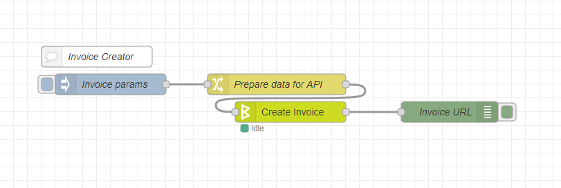
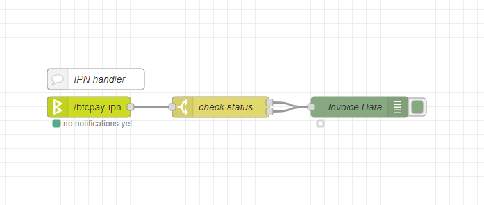

# BTCPay Nodes

<a href="http://nodered.org" target="_new">Node-RED</a> nodes to interact with <a href="https://btcpayserver.org/" target="_blank">BTCPay Server</a>.

## Install

Run the following command in the root directory of your Node-RED instance:

```
npm install --save node-red-contrib-btcpay
```

## Usage

This is a BTCPay API client node. It makes API requests by sending `msg.payload` data to the specified API endpoint and outputs the response data as `msg.payload`.

### Configuration

You first need to create a new BTCPay store:

1. Log in to your BTCPay Server instance
2. Go to Stores menu
3. Click on `Create a new store`
4. Enter a name
5. Push `Create`

Now you need to pair the client with your BTCPay store:

1. Navigate to `Stores > Settings > Access Tokens` on your BTCPay Server
2. Create a new token
3. Leave PublicKey blank
4. Request pairing
5. Copy pairing code
6. Open the client configuration in BTCPay-API node on your Node-RED
7. Enter the https URL to your BTCPay Server instance
8. Paste the pairing code
9. Click on `Pair client` - the private key and token fields will be automatically filled with your api credentials
10. Push `Update`

### Making requests

To make requests using the BTCPay API node, set the http method and the path to the API endpoint the node will call. These can be either specified in the node settings, or provided in `msg.method` (if the method is "via msg.method") and in `msg.path` (if the path is empty). The request body is the data in `msg.payload`.

After executing a request the node returns a message with the response data set to `msg.payload`.

### Creating Invoices

This example enables to create an invoice with params specified in the "Invoice params" node by clicking the inject button. The "Invoice URL" node outputs the url of the new invoice to Debug window.



Flow json for Node-RED: [btcpay-invoice-creator.json](examples/btcpay-invoice-creator.json)

### Handling Instant Payment Notifications (IPN)

This example implements an IPN handler. It checks if the invoice status is either "confirmed" or "complete" and outputs the invoice data to Debug window. As the incoming data cannot be trusted, it first fetches the invoice data via API.



Flow json for Node-RED: [btcpay-ipn-handler.json](examples/btcpay-ipn-handler.json)

## API Reference

BTCPay's API mimics Bitpay's one. The API Reference: https://bitpay.com/api/#rest-api-resources

## Developing Node

Build & Test in Watch mode:

```
yarn dev
```

[Read Node-RED docs](https://nodered.org/docs/creating-nodes/first-node#testing-your-node-in-node-red) on how to install the dev-version of the node into your local Node-RED runtime.

## License

MIT © Alex Kaul
